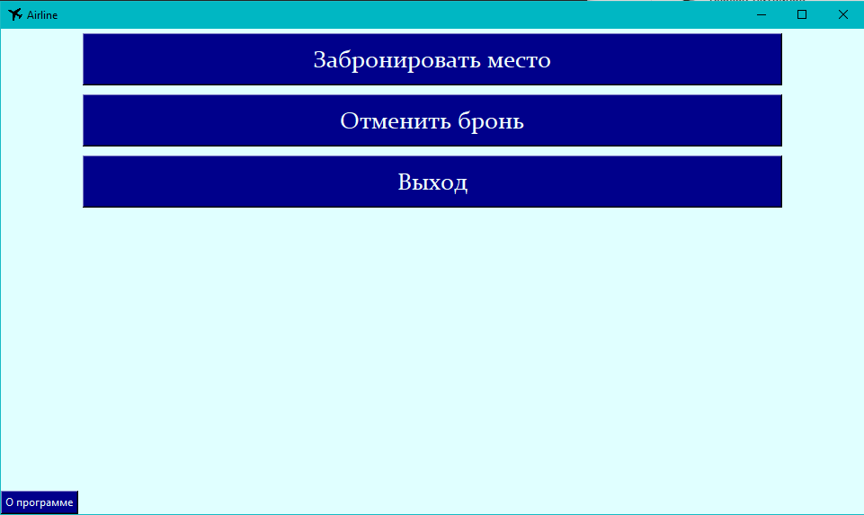
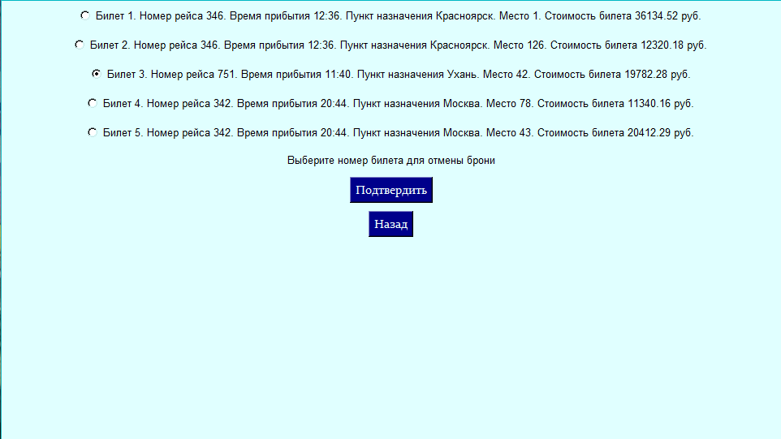

###Что это?
Программа содержит описание бизнес-процесса бронирования
мест в авиакомпании с графическим интерфейсом.

###Как этим пользоваться?
Запуск из командной строки  
`python -m main`
***
После запуска вы увидите главное меню  

***
При нажатии на кнопку "Забронировать место" будет предложено выбрать
пункт назначения и тариф  

***
После подтверждения будет предложен выбор места  

***
После ввода всплывёт окно подтверждения оплаты  

***
Вернёмся в главное меню. При нажатии на кнопку "Отмена брони" появится
список всех билетов. Будет предложен выбор билета для отмены  

***
Если забронированых мест нет, появится сообщение  
